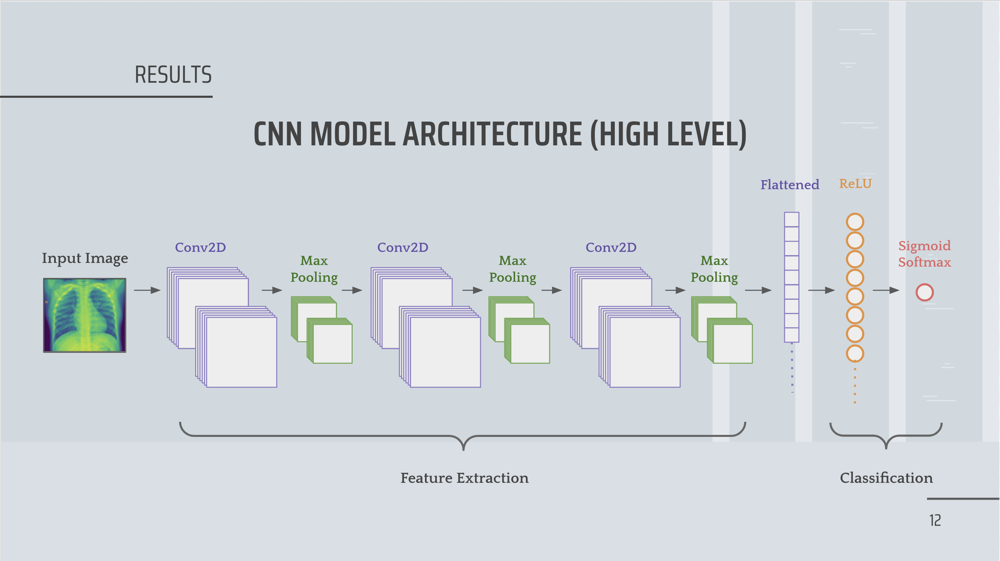

# Pneumonia-Detection-using-Deep-Learning
 An experiment to detect pneumonia in children aged 5 and below.
## Description
Pneumonia, a widespread lung infection, is often diagnosed using chest X-rays. However, accurately identifying pneumonia on X-rays can be challenging even for experienced radiologists. This can lead to delays in diagnosis and treatment, potentially increasing the severity of the illness and mortality rate.

## Objective 
Build a deep learning model that detects Pneumonia on patient's chest X-Ray images.

## Methodology
### 1. Data Collection
Data is obtained from Kaggle, which are chest X-Ray images of pediatric patients under age of 5 from a Medical Center in Guangzhou, China. It contains a total of 5,856 images in different sizes.

### 2. Data Exploration
As the validation dataset arranged by Kaggle is too small, I've re-split the entire dataset into this ratio: 70% train, 15% validation, and 15% test. The training dataset is distributed as 73.05% of X-rays has pneumonia and 26.95% doesn't. This is Set B of my data-set folder and I have used 5454 images in total. I also re-split the dataset into the ratio of 80% train, 10% validation, 10% test (named Set A), but it did not performed up to the mark so I finalized Set B.

### 3. Image Pre-processing
**To get the most out of the model's processing power, we normalized the pixel values in the chest X-rays to a range of 0 to 1.** Additionally, we used a technique called data augmentation to prevent the model from memorizing specific patterns in the training data, which could lead to poor performance on unseen images. Finally, since chest X-rays are essentially black and white images where darker areas represent denser tissues, we converted them to grayscale format with just one color channel. This simplifies the model's structure and reduces its computational burden.

### 4. Data Modelling
**Model Architecture**

The basic structure of a CNN model consists of CNN layer, followed by a pooling layer and an optional dropout, then fully connected layers with activations and output layer. I've tried different combinations of activations, dropout, and batch normalization, and below is the high-level architecture of my final and best performing convolutional neural network (CNN) model. 

The best performing model has a 
**Input Image: 64 x 64 x 1;
Conv2D layer: 5 x 5, 32 feature maps, ReLU;
batch size of 64 and 200 epochs;
Max Pooling: 2 x 2.
The Conv2D layer and Max Pooling is repeated 3 times.
Then the layers are flattened and diversed through 128 ReLU neurons and a sigmoid functions outputs 1 neuron.**

Since this is a binary classification problem, we used ReLU activation to output non-negative values and fed into a sigmoid softmax function that predicts an output probability, which can be converted to class values based on our threshold.

**Optimize for AUC score**
For the case of Pneumonia, we will aim to have high recall as any delayed diagnosis means that someone may get really sick and potentially lose their life. We do that by first having our model optimize for AUC score, focusing on having a good measure of separability for our binary classification. Then, we can crank the threshold up and down (from 0.5) if the business feels more comfortable with a higher or lower FP or FN.

## Results
### Fit
Through each epoch during the learning process, validation loss and training loss approach each other, which means our model doesn’t seem to have much overfitting or underfitting. Moreover, training and validation AUC score also converges to a point where they’re almost equal in the end.

### Metrics
The model has an AUC score of 97.11%, indicating that our CNN model can separate 97.11% of the images in the test set.
The model achieves 97.03% for recall, with 5.71% of False Positives and 2.17% of False Negatives, which is impressive and exactly what we’re aiming for.

